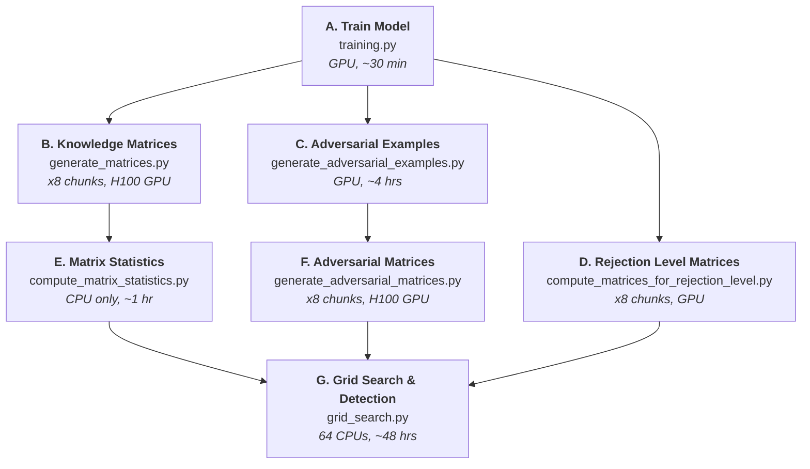

# Hidden Activations Are Not Enough

## A General Approach to Neural Network Predictions

This repository implements the paper [Hidden Activations Are Not Enough: A General Approach to Neural Network Predictions](https://arxiv.org/abs/2409.13163) by Samuel Leblanc, Aiky Rasolomanana, and Marco Armenta.

Given a neural network and a data sample, we compute a **knowledge matrix** (via quiver representations). These matrices capture the full linear behavior of the network at each input point. We use them to detect adversarial examples by comparing new samples' matrices against per-class statistics (mean and standard deviation) computed from the training set.

---

## Pipeline Overview

The experiment pipeline has 7 stages with the following dependency structure:



> Parallel paths (B, C, D) run simultaneously after training completes.

---

## Quick Start

### 1. Environment Setup

**Local machine:**
```bash
python -m venv venv
source venv/bin/activate
pip install -r requirements.txt
```

**Compute Canada / Alliance cluster:**
```bash
module load StdEnv/2023 python/3.11.5 scipy-stack/2025a
virtualenv env_rorqual
source env_rorqual/bin/activate
pip install --no-index --upgrade pip
pip install -r requirements-slurm.txt
pip install git+https://github.com/samueleblanc/knowledgematrix.git
```

### 2. Run an Experiment (Automated)

The **orchestrator** handles the entire pipeline with a single command:

```bash
# Full pipeline for one experiment
bash run_experiment.sh --skip-audit alexnet_cifar10

# Multiple experiments
bash run_experiment.sh --skip-audit alexnet_cifar10 resnet_cifar10 vgg_cifar100

# With checkpointing (audits what's already done, runs only missing steps)
bash run_experiment.sh alexnet_cifar10
```

The orchestrator automatically:
- Downloads datasets and pretrained weights if missing
- Validates experiment names against `constants/constants.py`
- Submits all pipeline stages with correct Slurm dependency chains
- Runs a final audit to verify all outputs

---

## Testing the Pipeline

Use `--test` mode to validate the entire pipeline end-to-end with tiny sample sizes:

```bash
# Quick test (~15 min total)
bash run_experiment.sh --test --skip-audit alexnet_cifar10

# Dry run (generates scripts without submitting)
bash run_experiment.sh --test --skip-audit --dry-run alexnet_cifar10
```

**Test mode parameters:**

| Parameter | Normal | Test |
|-----------|--------|------|
| Chunks | 8 | 2 |
| Batch size | 1800 | 100 |
| Samples/class | 100 | 10 |
| Samples/attack | 500 | 10 |
| Rejection level samples | 10,000 | 100 |
| Adv example test size | 10,000 | 100 |

After a test run, check the generated scripts:
```bash
ls experiments/alexnet_cifar10/orchestrator_jobs/
```

---

## Orchestrator Reference

```
bash run_experiment.sh [OPTIONS] experiment_name [experiment_name ...]
```

### Options

| Option | Default | Description |
|--------|---------|-------------|
| `--account ACCOUNT` | `def-assem` | Slurm billing account |
| `--total-chunks N` | `8` | Parallel chunks for matrix jobs |
| `--batch-size N` | `1800` | Matrix computation batch size |
| `--samples-per-class N` | `100` | Training samples per class for matrices |
| `--samples-per-attack N` | `500` | Adversarial examples per attack method |
| `--samples-rejection-level N` | `10000` | Samples for rejection level computation |
| `--test-size N` | `-1` (all) | Test set size for adversarial examples |
| `--env ENV_NAME` | `env_rorqual` | Python virtual environment name |
| `--skip-audit` | off | Skip audit, submit full pipeline |
| `--test` | off | Test mode with small samples and short limits |
| `--dry-run` | off | Generate scripts without submitting |

### Modes

**Audit mode** (default): Submits an audit job to check what's already computed, then a dispatcher job that reads the audit results and only submits the missing pipeline steps.

**Skip-audit mode** (`--skip-audit`): Submits the full pipeline A-G directly. Use for fresh experiments where nothing is precomputed.

### Pre-flight Checks

The orchestrator runs these checks on the login node before submitting jobs:

1. Validates experiment names exist in `DEFAULT_EXPERIMENTS`
2. Checks for required datasets, downloads if missing (CIFAR-10/100, MNIST)
3. Checks for pretrained weights (AlexNet/ResNet/VGG ImageNet), downloads if missing

---

## Slurm Resource Profiles

| Step | GPU | CPUs | Memory | Time |
|------|-----|------|--------|------|
| A. Training | A100 (10GB) | 3 | 31 GB | 30 min |
| B. Matrices (x8) | H100 | 12 | 280 GB | 20 min |
| C. Adversarial Examples | 1 GPU | 16 | 124 GB | 4 hrs |
| D. Rejection Levels (x8) | 1 GPU | 16 | 180 GB | 9 hrs |
| E. Matrix Statistics | -- | 2 | 16 GB | 1 hr |
| F. Adv Matrices (x8) | H100 | 12 | 280 GB | 12 hrs |
| G. Grid Search | -- | 64 | 2.6 TB | 48 hrs |

---

## Running Individual Steps

Each step can be run manually if needed.

### A. Train the Network
```bash
python training.py --experiment_name alexnet_cifar10 --temp_dir $SLURM_TMPDIR
```
Outputs: `experiments/alexnet_cifar10/weights/epoch_*.pth`

### B. Generate Knowledge Matrices
```bash
python generate_matrices.py --experiment alexnet_cifar10 --chunk_id 0 --total_chunks 8 \
    --batch_size 1800 --num_samples_per_class 100 --temp_dir $SLURM_TMPDIR
```
Outputs: `experiments/alexnet_cifar10/matrices/{class}/{sample}/matrix.pt`

### C. Generate Adversarial Examples
```bash
python generate_adversarial_examples.py --experiment_name alexnet_cifar10 \
    --temp_dir $SLURM_TMPDIR
```
Outputs: `experiments/alexnet_cifar10/adversarial_examples/{attack}/adversarial_examples.pth`

### D. Compute Rejection Level Matrices
```bash
python compute_matrices_for_rejection_level.py --experiment_name alexnet_cifar10 \
    --chunk_id 0 --total_chunks 8 --batch_size 1800 --temp_dir $SLURM_TMPDIR
```
Outputs: `experiments/alexnet_cifar10/rejection_levels/matrices/{i}/matrix.pth`

### E. Compute Matrix Statistics
```bash
python compute_matrix_statistics.py --experiment_name alexnet_cifar10 --temp_dir $SLURM_TMPDIR
```
Outputs: `experiments/alexnet_cifar10/matrices/matrix_statistics.json`

### F. Generate Adversarial Matrices
```bash
python generate_adversarial_matrices.py --experiment_name alexnet_cifar10 \
    --chunk_id 0 --total_chunks 8 --batch_size 1800 --samples_per_attack 500 \
    --temp_dir $SLURM_TMPDIR
```
Outputs: `experiments/alexnet_cifar10/adversarial_matrices/{attack}/{i}/matrix.pth`

### G. Grid Search and Detection
```bash
python grid_search.py --experiment_name alexnet_cifar10 --rej_lev 0 \
    --nb_workers 64 --temp_dir $SLURM_TMPDIR
```
Outputs: `experiments/alexnet_cifar10/grid_search/`, `experiments/alexnet_cifar10/rejection_levels/reject_at_*.json`

---

## Experiment Directory Structure

```
experiments/alexnet_cifar10/
|
|-- weights/
|   |-- epoch_10.pth
|   |-- epoch_20.pth
|   |-- ...
|   +-- epoch_70.pth                       <- Step A
|
|-- matrices/
|   |-- 0/                                 <- Class 0
|   |   |-- 0/matrix.pt
|   |   |-- 1/matrix.pt
|   |   +-- ...
|   |-- 1/                                 <- Class 1
|   |   +-- ...
|   +-- matrix_statistics.json             <- Step E
|
|-- matrices_task_0.zip                    <- Step B (chunk 0)
|-- matrices_task_1.zip
|-- ...
|-- matrices_task_7.zip                    <- Step B (chunk 7)
|
|-- adversarial_examples/
|   |-- test/
|   |   |-- adversarial_examples.pth
|   |   +-- labels.pth
|   |-- GN/
|   |   |-- adversarial_examples.pth
|   |   +-- wrong_predictions.pth
|   |-- FGSM/
|   |-- PGD/
|   +-- ...                                <- Step C (17 attacks)
|
|-- adversarial_matrices/
|   |-- test/0/matrix.pth
|   |-- GN/0/matrix.pth
|   +-- ...
|
|-- adv_matrices_task_0.zip                <- Step F (chunk 0)
|-- ...
|-- adv_matrices_task_7.zip                <- Step F (chunk 7)
|
|-- rejection_levels/
|   |-- exp_dataset_train.pth
|   |-- exp_dataset_labels.pth
|   |-- matrices/
|   |   |-- 0/matrix.pth
|   |   |-- 0/prediction.pth
|   |   +-- ...
|   |-- matrices_task_0.zip                <- Step D (chunk 0)
|   |-- ...
|   +-- reject_at_*.json                   <- Step G
|
|-- grid_search/
|   +-- grid_search.txt                    <- Step G (final results)
|
|-- audit_report.json                      <- Data integrity report
|-- recovery_plan.sh                       <- Auto-generated recovery plan
+-- orchestrator_jobs/                     <- Generated Slurm scripts
```

---

## Available Experiments

Experiments are defined in `constants/constants.py`. Key experiments:

| Name | Architecture | Dataset | Epochs |
|------|-------------|---------|--------|
| `alexnet_cifar10` | AlexNet (pretrained) | CIFAR-10 | 70 |
| `resnet_cifar10` | ResNet18 | CIFAR-10 | 100 |
| `resnet_cifar100` | ResNet18 | CIFAR-100 | 100 |
| `vgg_cifar100` | VGG11 | CIFAR-100 | 150 |
| `mlp_mnist` | MLP (512x3) | MNIST | 5 |
| `lenet_cifar10` | LeNet CNN | CIFAR-10 | 507 |

### Adding New Experiments

Add an entry to `DEFAULT_EXPERIMENTS` in `constants/constants.py`:

```python
'my_experiment': {
    'dataset': 'cifar10',           # mnist, fashion, cifar10, cifar100, imagenet
    'architecture_index': -3,       # -3=AlexNet, -2=ResNet18, -1=VGG11, -4=LeNet
    'epochs': 50,
    'batch_size': 32,
    'lr': 0.001,
    'optimizer': 'adam',            # adam, sgd
    'momentum': 0.0,
    'weight_decay': 0.001,
    'scheduler': 'multi',          # step, cosine, exp, multi, cyclic
}
```

Then run:
```bash
bash run_experiment.sh --skip-audit my_experiment
```

---

## Adversarial Attacks

The pipeline tests 17 adversarial attack methods (from `torchattacks`):

| Category | Attacks |
|----------|---------|
| Noise | GN (Gaussian Noise) |
| Gradient-based | FGSM, PGD, EOTPGD, MIFGSM, VMIFGSM |
| Optimization-based | CW (Carlini-Wagner), DeepFool, Pixle |
| AutoAttack family | APGD, APGDT, FAB, Square |
| Other | SPSA, EADL1, EADEN |

Attacks that fail to produce any misclassified examples are automatically skipped (logged as warnings). Individual attack failures do not crash the pipeline.

---

## Data Integrity and Auditing

The audit system (`utils/data_integrity.py`) verifies all experiment artifacts:

```bash
# Run a standalone audit
sbatch job_audit.sh

# Run recovery for failed steps
bash job_recovery.sh
```

The audit checks:
- All matrix zip files exist and are valid
- `.pth` tensors inside zips can be loaded (random 10% sample)
- All adversarial example files exist
- Matrix statistics JSON exists
- Grid search results exist

Recovery plans are auto-generated with dependency propagation (e.g., if Step B fails, Steps E and G are also flagged for re-run).

---

## Error Resilience

The pipeline handles errors gracefully:

- **Numerical errors** in matrix computation (NaN/Inf from activation ratios): automatically replaced with zeros, individual matrices that fail entirely are skipped with a warning
- **Adversarial attack failures**: attacks that crash or produce 0 adversarial examples are skipped, logged, and the pipeline continues
- **Zip corruption**: verified before copying to permanent storage; corrupted files trigger re-computation

---

## Troubleshooting

| Problem | Solution |
|---------|----------|
| `TypeError: AlexNet.__init__() got an unexpected keyword argument 'freeze_features'` | Update the `knowledgematrix` package: `pip install --upgrade git+https://github.com/samueleblanc/knowledgematrix.git` |
| `FileNotFoundError: pretrained-weights.pth` | Run the orchestrator, which downloads pretrained weights automatically. Or manually: `python -c "from torchvision.models import alexnet, AlexNet_Weights; import torch; torch.save(alexnet(weights=AlexNet_Weights.DEFAULT).state_dict(), 'experiments/alexnet_imagenet/weights/pretrained-weights.pth')"` |
| Out of memory on GPU | Reduce `--batch-size` (e.g., from 1800 to 900) |
| Job timeout | Increase time limits in the orchestrator or individual job scripts |
| Missing dataset on compute node | The orchestrator downloads datasets during pre-flight checks. For manual runs: `python -c "from torchvision.datasets import CIFAR10; CIFAR10(root='./data', train=True, download=True)"` |

---

## Repository Structure

```
.
|-- run_experiment.sh              <- Pipeline orchestrator (start here)
|-- training.py                    <- Step A: model training
|-- generate_matrices.py           <- Step B: knowledge matrix computation
|-- generate_adversarial_examples.py <- Step C: adversarial attacks
|-- compute_matrices_for_rejection_level.py <- Step D: rejection level matrices
|-- compute_matrix_statistics.py   <- Step E: per-class statistics
|-- generate_adversarial_matrices.py <- Step F: matrices for adversarial examples
|-- grid_search.py                 <- Step G: grid search and detection
|-- constants/
|   +-- constants.py               <- Experiment configs, architectures, attacks
|-- utils/
|   |-- utils.py                   <- Model loading, datasets, utilities
|   +-- data_integrity.py          <- Zip verification, experiment auditing
|-- matrix_construction/
|   |-- parallel.py                <- Parallel matrix computation
|   +-- matrix_computation.py      <- Core matrix computation logic
|-- model_zoo/                     <- Local model implementations
|-- unit_test/                     <- Unit tests
|-- job_*.sh                       <- Individual Slurm job scripts
+-- experiments/                   <- Experiment outputs (auto-created)
```
